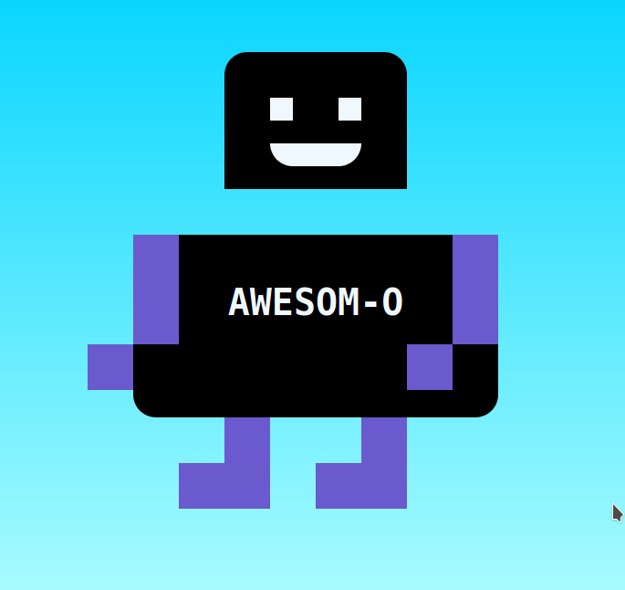

# Make me a happy Robot!

## Installation

Run `npm install`

## Usage

To run the live server, run `npm run serve`

## Task

Help! My robot friend Awesom-O has been broken up into small parts!

Please fix my robot friend :(

1) You will need to use `position: absolute` to re-position his parts

2) The HTML is already written for you

3) You need to update the CSS

4) Here is a reference image you can use to see how he should look:

Good luck!

## Resources

[https://learnlayout.com/position.html](https://learnlayout.com/position.html)

[https://developer.mozilla.org/en-US/docs/Web/CSS/position](https://developer.mozilla.org/en-US/docs/Web/CSS/position)